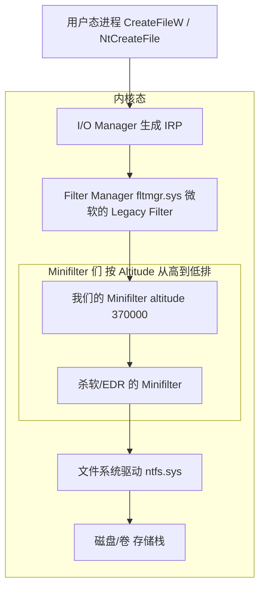
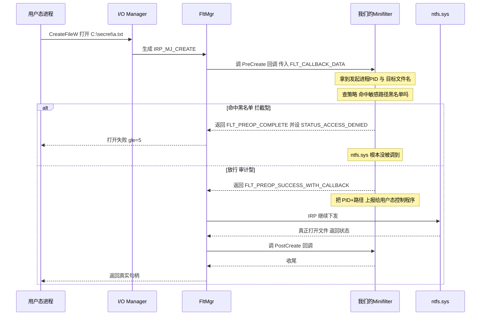
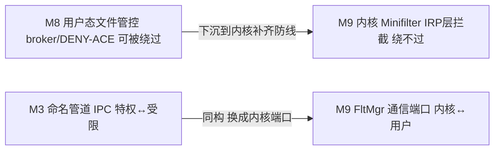

# M9 学习笔记（上）— 内核 Minifilter 驱动：架构与骨架讲透

> 本篇先**讲透原理**（架构 / IRP 拦截时序 / 骨架 / 环境 / 与前 8 个 milestone 的关系），确定形态后再写代码补《M9（下）》。
>
> **一句话**：M8 的文件管控还在**用户态**（broker 代劳 / DENY-ACE），用户态防线理论上能被绕过（直接调 `NtCreateFile`、改 ACL、TOCTOU）；M9 把文件管控下沉到**内核 IRP 层**——用 Minifilter 在文件系统请求真正落盘前拦截，这是"用户态能绕、内核态才是真防线"的纵深收口。对应 JD Windows(e)：**Minifilter / NTFS 权限 / 文件读写审计 / 敏感路径隔离**。

---

## 一、为什么需要内核 Minifilter（M8 用户态防线的天花板）

M8 做了两条用户态路线，但都有"内核态才能补"的缺口：

| M8 用户态手段 | 能被怎么绕过 | M9 内核 Minifilter 怎么补 |
|---|---|---|
| broker 代劳 + 白名单 | target 不走 broker，直接 `NtCreateFile` 打开文件 | Minifilter 在**所有**文件请求的 IRP 上拦，绕不过 |
| DENY-ACE 改 DACL | 有 `WRITE_DAC` 权限就能把 DENY 改掉 | Minifilter 不依赖客体 ACL，在 I/O 路径上判定 |
| GetFinalPathNameByHandle 防 TOCTOU | 用户态检查和使用仍有时间差 | 内核在 IRP_MJ_CREATE 里拿到的就是最终解析对象 |

**核心认知**：用户态一切文件 API（`CreateFileW` / `fopen` / `NtCreateFile`）最终都变成一个 **IRP（I/O Request Packet）** 往文件系统栈上走。只要挂在这条栈上，就能拦到**任何进程、任何路径**的文件操作——这就是内核过滤的价值，也是 EDR/DLP/杀软的看家本领。

---

## 二、Minifilter 在 Windows I/O 栈里的位置



关键点：
- **FltMgr（`fltmgr.sys`）本身是一个 Legacy Filter Driver**，它注册在文件系统栈上，然后把"过滤"这件事再分发给挂在它下面的一堆 **Minifilter**。我们写的 `.sys` 挂在 FltMgr 上，**不直接碰 IRP 栈**——这就是 Minifilter 相对老式 Legacy Filter 的最大好处：FltMgr 帮你处理了 IRP 栈管理、层级顺序、动态加载卸载这些极易蓝屏的脏活。
- **Altitude（高度）**：每个 Minifilter 有一个唯一的 altitude 数字，决定它在栈上的**顺序**（数字大的先看到请求）。正式产品要向微软申请 altitude；学习用可以借一个未占用的（如 `370000`，属于 FSFilter Activity Monitor 区间）。
- **Pre / Post 回调**：一个 IRP 下去（Pre）和上来（Post）各经过一次 Minifilter。拦截/审计主要在 **Pre-Create** 做。

---

## 三、一次文件打开的 IRP 拦截时序



**PreCreate 三种返回值（JD 高频考点）**：
- `FLT_PREOP_SUCCESS_NO_CALLBACK`：放行，且**不要** PostCreate（省开销，纯放行用它）。
- `FLT_PREOP_SUCCESS_WITH_CALLBACK`：放行，但要 PostCreate（要在打开后做事，如审计结果用它）。
- `FLT_PREOP_COMPLETE`：**我直接把这个请求完成掉**，设 `Data->IoStatus.Status = STATUS_ACCESS_DENIED`，请求不再下发给 ntfs.sys——**这就是"拦截"**。

---

## 四、Minifilter 骨架（代码结构预览）

```c
// 1) 注册回调数组：告诉 FltMgr 我关心哪些 IRP major function
const FLT_OPERATION_REGISTRATION Callbacks[] = {
    { IRP_MJ_CREATE, 0, PreCreate, PostCreate },   // 文件打开/创建
    // 可选: IRP_MJ_WRITE / IRP_MJ_SET_INFORMATION(改名删除) ...
    { IRP_MJ_OPERATION_END }
};

// 2) 注册结构：版本 + 回调数组 + 各种可选回调（context/unload 等）
const FLT_REGISTRATION FilterRegistration = {
    sizeof(FLT_REGISTRATION), FLT_REGISTRATION_VERSION,
    0, NULL, Callbacks,
    MiniUnload,            // 卸载回调（fltmc unload 时）
    InstanceSetup, InstanceQueryTeardown, ...
};

// 3) 驱动入口：注册 + 开始过滤
NTSTATUS DriverEntry(PDRIVER_OBJECT DriverObject, PUNICODE_STRING RegistryPath) {
    FltRegisterFilter(DriverObject, &FilterRegistration, &gFilterHandle);
    FltStartFiltering(gFilterHandle);   // 从这一刻起 PreCreate 开始被调用
    return STATUS_SUCCESS;
}

// 4) Pre-Create：拦截/审计的核心
FLT_PREOP_CALLBACK_STATUS PreCreate(PFLT_CALLBACK_DATA Data,
                                    PCFLT_RELATED_OBJECTS FltObjects,
                                    PVOID *CompletionContext) {
    // FltGetFileNameInformation 拿目标路径
    // PsGetCurrentProcessId 拿发起进程
    // 查策略 -> 命中则 Data->IoStatus.Status = STATUS_ACCESS_DENIED; return FLT_PREOP_COMPLETE;
    //          否则 return FLT_PREOP_SUCCESS_NO_CALLBACK;
}
```

**用户态 ↔ 内核态通信（审计上报 / 策略下发）**：用 **FltMgr 的通信端口**（`FltCreateCommunicationPort` 内核侧 + `FilterConnectCommunicationPort` 用户侧），这是 Minifilter 专用的 IPC，比自己开 DeviceIoControl 更规范。这一环正好呼应 M3/M8 的"特权↔受限 IPC"主题，只是换成内核端口。

---

## 五、交付物清单（三形态都要）

| 文件 | 作用 |
|---|---|
| `sandbox_minifilter.sys` | 驱动本体（WDK 编译） |
| `sandbox_minifilter.inf` | 安装信息（含 altitude / 服务类型 `FSFilter`） |
| `mf_ctl.exe`（用户态控制程序） | 连通信端口，收审计上报 / 下发策略，打印 |
| `install_mf.bat` / `run_mf.bat` | `sc create` + `fltmc load` / `fltmc unload` |

**环境准备（真编真跑需要）**：
1. **测试签名模式**：`bcdedit /set testsigning on` + 重启（否则未签名 .sys 加载失败）。
2. **强烈建议在 VM 里跑**：内核代码 bug = 蓝屏（BSOD），VM 可快照回滚，别在主力机首跑。
3. 调试用 **WinDbg 内核调试**（VM + 串口/网络 kd）或 `DbgPrint` + DebugView（勾选 Capture Kernel）。

---

## 六、与前 8 个 milestone 的关系



- **M8 → M9**：同一个"文件管控"主题，从用户态下沉到内核态，形成"用户态策略 + 内核态兜底"的纵深。
- **M3 → M9**：都是"特权侧 ↔ 受限侧"结构化 IPC，M9 换成 FltMgr 通信端口。
- **面试主线**：M8 讲"用户态怎么做文件代理"，M9 讲"为什么用户态不够、内核 Minifilter 怎么兜底"——一套组合拳。

---

## 七、读完你应该能回答（JD 高频三问）

1. **Minifilter vs Legacy Filter Driver 差别？为什么用 Minifilter？**
   Legacy 自己插进文件系统 IRP 栈、自己管顺序和 IRP 传递，极易出错且卸载困难；Minifilter 挂在 FltMgr（`fltmgr.sys`）这个微软托管的 Legacy Filter 下，由 FltMgr 统一管栈序（altitude）、Pre/Post 分发、动态加载卸载。开发简单、稳定、可热插拔。

2. **Altitude 是什么？为什么要申请？**
   决定 Minifilter 在过滤栈上的顺序的唯一数字，数字大的先看到请求。为避免多个厂商冲突，正式产品的 altitude 要向微软申请登记（按功能分区间，如反病毒 320000-329999、活动监控 360000-389999）。学习用借一个空闲值即可。

3. **PreCreate 三种返回值区别？** 见 § 三。核心是 `FLT_PREOP_COMPLETE` + 设 `STATUS_ACCESS_DENIED` = 从内核挡住请求。

---

## 八、形态确定：A+B（审计 + 拦截 + 用户态下发策略）

- **形态 A 审计型**：PreCreate 对每次 create 上报 PID+路径给用户态，不拦。命中 JD"文件读写审计"。
- **形态 B 拦截型**：PreCreate 对命中敏感路径黑名单的返回 `STATUS_ACCESS_DENIED`。比 M8 DENY-ACE 更底层不可绕过，命中 JD"敏感路径隔离"。
- **A+B 合一**：一个 Minifilter 同时审计 + 拦截，黑名单由用户态控制程序经通信端口下发，类比 M6/M8 的双形态。

---

# M9 学习笔记（下）— 实现、编译加载、实测、话术

## 九、代码落点

| 文件 | 作用 |
|---|---|
| `src/minifilter/sandbox_minifilter.c` | 驱动本体：`DriverEntry`(注册+建端口+FltStartFiltering) + `PreCreate`(审计+拦截) + 通信端口三回调(Connect/Disconnect/Message) + `MiniUnload` |
| `src/minifilter/mf_protocol.h` | 内核↔用户共享协议：`MfAuditRecord`(内核→用户) + `MfPolicyUpdate`(用户→内核) + 端口名/上限常量 |
| `src/minifilter/sandbox_minifilter.inf` | 安装信息：`ServiceType=2`(文件系统驱动) + `FSFilter Activity Monitor` 组 + `Altitude=370000` |
| `src/minifilter/sandbox_minifilter.vcxproj` | WDK 驱动工程 |
| `src/minifilter/mf_ctl.cc` | 用户态控制程序：连端口 + 下发黑名单 + 循环收审计打印（主 CMake `mf_ctl` target，链接 `fltlib`） |
| `install_mf.bat` / `run_mf.bat` / `uninstall_mf.bat` | 加载 / 运行 / 卸载（自动提权，遵循 .bat 硬规则） |

## 十、几个关键实现点（面试可讲）

1. **只拦用户态请求**：`PreCreate` 开头判 `Data->RequestorMode == KernelMode` 直接放行——内核自身 I/O（如分页、系统组件）不该被我们的策略干扰，只管用户态发起的 create。

2. **规范化文件名**：`FltGetFileNameInformation(FLT_FILE_NAME_NORMALIZED)` + `FltParseFileNameInformation`，拿到的是 `\Device\HarddiskVolumeN\...` 形式的**规范化全路径**（已解析短名/符号链接），比用户态字符串可靠——这正是内核过滤天然免疫 TOCTOU/symlink 绕过的原因（M8 要靠 GetFinalPathNameByHandle 补，内核这里天生就是最终对象）。

3. **拦截 = `FLT_PREOP_COMPLETE` + `STATUS_ACCESS_DENIED`**：命中黑名单时设 `Data->IoStatus.Status` 并返回 COMPLETE，请求**不再下发给 ntfs.sys**，从内核层挡死。

4. **通信端口 + SD 收紧**：`FltCreateCommunicationPort` 建端口，`FltBuildDefaultSecurityDescriptor(FLT_PORT_ALL_ACCESS)` 让端口**只允许 Admin/SYSTEM 连**（防低权限进程乱下发策略）。审计用 `FltSendMessage`(内核→用户，带 50ms 超时防卡)，策略下发走 `PortMessage` 回调(用户→内核)。

5. **不信任对端 + 防溢出**：`PortMessage` 里对用户态下发的 `MfPolicyUpdate` 做长度校验 + `__try/__except` 防非法指针 + 逐条夹紧 `len_chars`——内核里字符串溢出 = 蓝屏甚至提权漏洞，边界校验是铁律。

6. **并发保护**：黑名单读（PreCreate 高频）/写（策略下发）用 `KSPIN_LOCK` 保护。

## 十一、编译 / 加载 / 实测步骤

详见 `src/minifilter/README.md`，摘要：

```
# 一次性（VM 里！）：bcdedit /set testsigning on + 重启
# 编驱动：VS+WDK 打开 sandbox_minifilter.vcxproj -> x64/Debug -> sandbox_minifilter.sys
# 编控制程序：cmake --build build_m0 --config Debug --target mf_ctl   （已验证通过）
install_mf.bat      # sc create + fltmc load
run_mf.bat          # 下发 "\sandbox_secret\" 黑名单 + 收审计
# 另开窗口 notepad C:\sandbox_secret\a.txt -> 拒绝访问
uninstall_mf.bat    # fltmc unload + sc delete
```

## 十二、预期实测（形态 A+B）

`run_mf.bat` 窗口（用户态控制程序）预期：
```
[mf_ctl] 已连上 Minifilter 通信端口 \SandboxMiniFilterPort
[mf_ctl] 已下发策略：1 条敏感关键词
[mf_ctl] 开始接收审计上报，Ctrl+C 退出……
-----------------------------------------------------------
[audit] pid=1234   allow     \DEVICE\HARDDISKVOLUME3\USERS\...\SOMEFILE.DLL
[audit] pid=6788   BLOCKED ⭐ \DEVICE\HARDDISKVOLUME3\SANDBOX_SECRET\A.TXT
```
- 记事本打开 `C:\sandbox_secret\a.txt` → **拒绝访问**（内核 STATUS_ACCESS_DENIED）。
- 其它文件打开 → `allow` 审计流不断刷。

> 本 milestone 的驱动需 WDK 真机/VM 编译加载。**驱动本体 `sandbox_minifilter.sys` 已在本机 WDK 环境编译通过**（VS2022 Pro + WDK 10.0.26100，产物 `src/minifilter/x64/Debug/sandbox_minifilter.sys` ~8.7KB，C 代码零 error）；用户态 `mf_ctl` 亦编译通过。**加载/拦截实测在 VM 里做**（testsigning + fltmc load），实测输出待回填（对齐 M6/M7/M8 的"实测存档"惯例）。
>
> 编译时踩的三个环境/打包坑（非代码问题，已记入 `src/minifilter/README.md`）：① MSB8040 需 Spectre 缓解库 → 工程关 `SpectreMitigation`；② InfVerif.dll 找不到 / inf2cat -2 → 补 INF `[SourceDisksFiles]` 段 + 关打包 `EnableInf2cat/GenerateDriverPackage`；③ SignTool 缺 /fd → 关自动签名，加载时 VM 里单独处理。

## 十三、与 M8 的纵深关系（面试主线）

| 维度 | M8 用户态 | M9 内核 Minifilter |
|---|---|---|
| 拦截层 | 用户态 broker / DACL | 内核 IRP_MJ_CREATE |
| 能否绕过 | 可（直接 NtCreateFile / 改 DACL） | 否（所有用户态 create 都过 FltMgr） |
| 防 TOCTOU | 靠 GetFinalPathNameByHandle 补 | 天生：内核拿到的就是最终对象 |
| 影响面 | 单 target / 单目录 | 全机所有进程的文件 create |
| 崩溃代价 | 进程崩 | 蓝屏（须 VM + 谨慎） |

## 十四、面试话术

> "M8 我把文件管控做在用户态（broker 代劳 + DENY-ACE），但用户态防线能被绕过——target 直接调 `NtCreateFile`、或有 `WRITE_DAC` 就能改掉我加的 DENY-ACE。所以 M9 我把它下沉到内核：写了个文件系统 **Minifilter**，挂在 FltMgr 下、altitude 370000，在 **IRP_MJ_CREATE 的 Pre 回调**里拿发起进程 PID 和 `FltGetFileNameInformation` 规范化后的路径，命中敏感路径黑名单就 `FLT_PREOP_COMPLETE` + `STATUS_ACCESS_DENIED` 从内核挡死，其余放行；无论放行拦截都通过 **FltMgr 通信端口** 上报审计给用户态控制程序。黑名单由用户态经端口下发，端口 SD 只放行 Admin/SYSTEM。这套东西的价值：① 覆盖全机任意进程任意路径，绕不过；② 内核拿到的是最终解析对象，天然免疫 TOCTOU/symlink——这正好补上 M8 用户态那层缺口。这是 EDR/DLP 产品做文件审计和敏感路径隔离的同款机制。"

## 十五、下次触发本文档

- "Minifilter 架构 / IRP 拦截 / altitude / PreCreate 返回值？" → 上篇 § 二~四、§ 七
- "驱动怎么编怎么加载？" → 下篇 § 十一 + `src/minifilter/README.md`
- "内核态和用户态文件管控怎么配合？" → 下篇 § 十三、§ 十四
- "内核代码怎么防不可信输入 / 防蓝屏？" → 下篇 § 十.5
- 相关：`M8.md`（用户态文件管控）、`kernel_objects_101.md`（File 对象 / IRP / SeAccessCheck）
