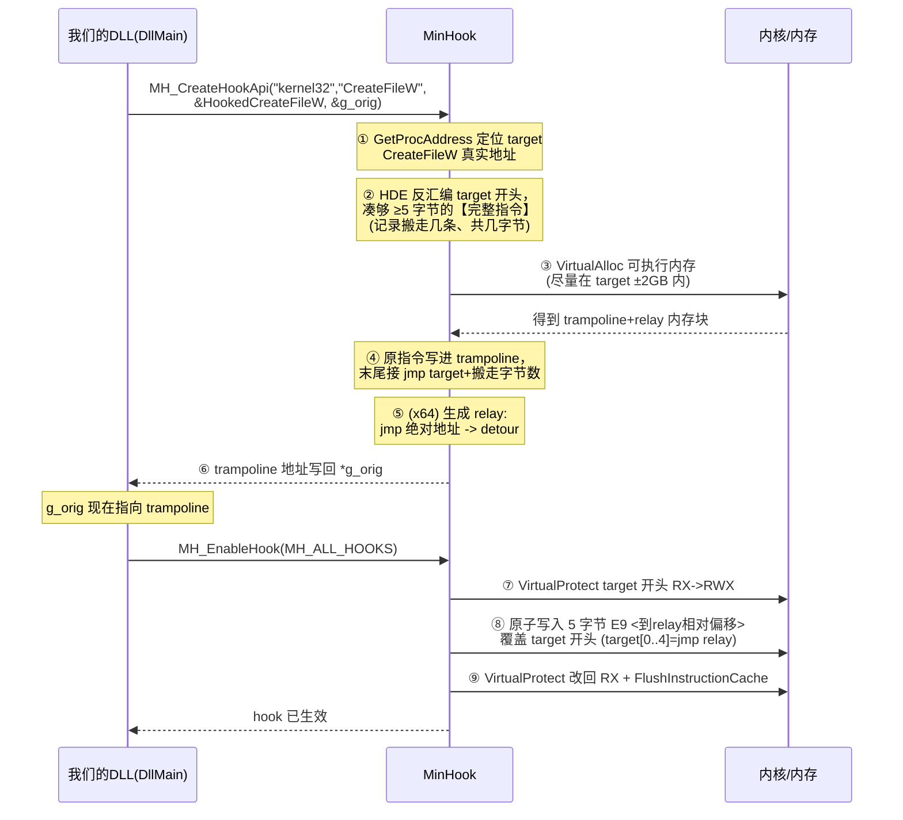
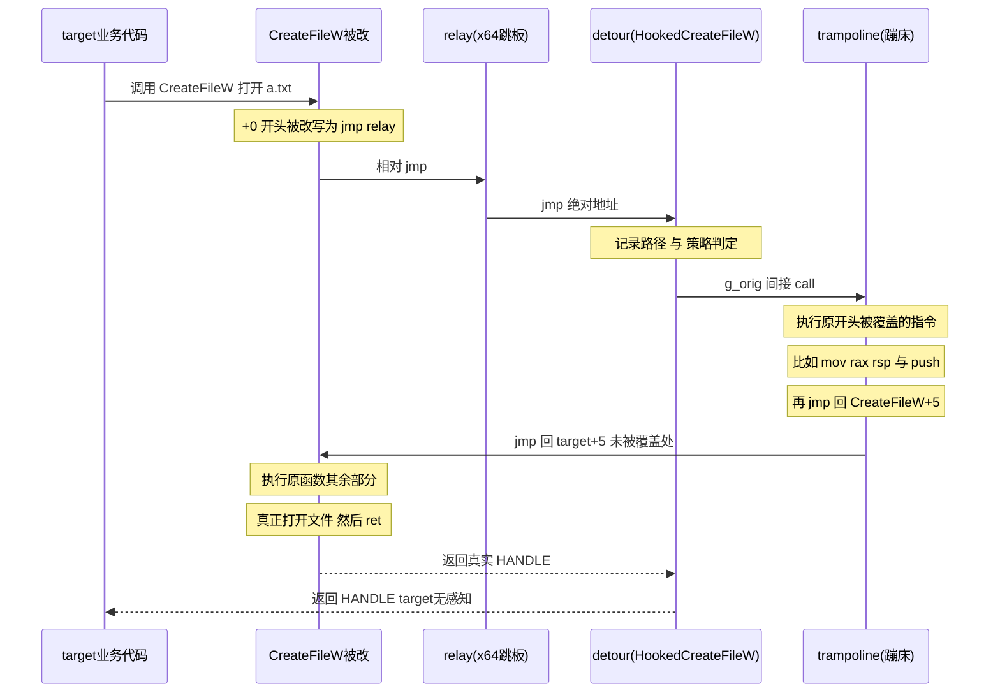

# MinHook Inline Hook 深挖：relay / trampoline 结构与时序

> M4 我们用 MinHook 钩住 `CreateFileW`（M7 钩 `GetAddrInfoW`），核心只调了 `MH_CreateHookApi` + `MH_EnableHook`。这份笔记把它**底层到底改了什么内存、trampoline 这个"蹦床"结构长什么样、detour 怎么借它调回原函数**彻底画清楚。
>
> 依据：vendored 源码 `src/third_party/minhook/src/{hook.c,trampoline.c,buffer.c}`（x64）。

---

## 一、先厘清四个角色（别混）

| 角色 | 是什么 | 谁写的 | 位置 |
|---|---|---|---|
| **target 函数** | 被 hook 的原函数，如 `kernel32!CreateFileW` | 系统 | 系统模块代码段 |
| **detour 函数** | 我们的钩子回调，如 `HookedCreateFileW` | 我们（dns_hook.cc / sandbox_hook.cc） | 我们 DLL 的代码段 |
| **trampoline（蹦床）** | 一小块**单独分配的可执行内存**，装"原函数被覆盖的那几条指令 + 跳回原函数续执行的 jmp" | MinHook 运行时生成 | MinHook 分配的可执行内存池 |
| **relay**（仅 x64） | 一小段"绝对跳转"跳板，解决 x64 里 target→detour 距离超过 ±2GB 时 5 字节相对 jmp 跳不到的问题 | MinHook 运行时生成 | 同 trampoline 内存池 |

**一句话关系**：
- target 开头被改成"跳到 detour"（x64 经 relay 中转）
- detour 里想执行原逻辑时，**调用 trampoline**
- trampoline = 原函数被覆盖的指令 + "跳回原函数没被覆盖的部分"

⭐ **关键澄清（你问题里的重点）**：**不是"trampoline 被拷贝进 detour 函数体"**。detour 是我们写死的代码，它里面存了一个函数指针 `g_orig_Xxx`，这个指针**指向 trampoline**；detour 通过 `g_orig_Xxx(...)` **调用** trampoline 来获得"执行原函数"的能力。trampoline 是独立内存，detour 只是持有它的地址。

---

## 二、内存布局：hook 前 vs hook 后

### hook 前

```
kernel32 代码段:
  CreateFileW:
    +0:  mov  rax, rsp          ┐
    +3:  push rbx               │ 原函数开头的真实指令
    +4:  push rsi               │ （加起来 ≥ 5 字节，够放一条 jmp）
    +5:  sub  rsp, 0x...        ┘
    ...  (函数其余部分)
```

### hook 后（x64，MinHook 实际做法）

```
kernel32 代码段:
  CreateFileW:
    +0:  jmp  <relay>       ← ⭐ 开头被改写成 5 字节相对 jmp（E9 xx xx xx xx）
    +5:  sub  rsp, 0x...    ← 从这里开始是"没被覆盖"的原指令
    ...

MinHook 可执行内存池（VirtualAlloc 的一块，尽量靠近 target 以便 ±2GB 内）:
  <relay>:                  ← 仅 x64 需要：跳板
    jmp  [rip+0] -> <HookedCreateFileW>   (FF 25 ... 绝对跳，跳到我们的 detour)

  <trampoline>:             ← ⭐ 蹦床本体
    mov  rax, rsp           ┐ 从 target 开头"搬"过来的原指令
    push rbx                │ （HDE 反汇编按指令边界完整搬，
    push rsi                ┘  不会截断半条指令）
    jmp  <CreateFileW+5>    ← 跳回原函数"没被覆盖"的下一条指令，续执行

我们 DLL 代码段:
  HookedCreateFileW:        ← detour（我们写的）
    ... 记录/判定 ...
    return g_orig_CreateFileW(...)   ← g_orig 指向 <trampoline>
```

**为什么要 relay（x64 专属）**：x86 的 5 字节 `E9` 是相对跳转，偏移是 32 位有符号数 = 只能跳 ±2GB。x64 里 kernel32 和我们 DLL 可能相距超过 2GB，`jmp detour` 一步跳不到 → 先 `jmp relay`（relay 在 target 附近 2GB 内），relay 用 `FF 25`（`jmp [rip+0]` 读紧跟其后的 64 位绝对地址）跳到 detour。x86 因为地址空间小通常不需要 relay。

---

## 三、时序图 A：安装 hook（MH_CreateHook + MH_EnableHook）



**②的关键——为什么要 HDE 反汇编**：不能只 memcpy 前 5 字节。x86/x64 指令是变长的，前 5 字节可能"切断"某条指令的中间。必须用 HDE（Hacker Disassembler Engine）**按指令边界**解析，搬走"覆盖到的所有完整指令"（可能是 6、7 字节），trampoline 里放的必须是完整指令，jmp 回去也要跳到完整指令的边界。

---

## 四、时序图 B：hook 生效后，一次 CreateFileW 调用



**读这张图的三个要点**：
1. **target 每次调用先被"劫持"到 detour**（经 relay）——这是"拦截"。
2. **detour 调 `g_orig(...)` = 跳进 trampoline** —— trampoline 先执行"原函数开头那几条被覆盖的指令"，再 `jmp` 回原函数第 5 字节处续跑。**等于把原函数完整跑完**，只是入口那几条指令的执行地点搬到了 trampoline。
3. **绝不能在 detour 里直接调 `CreateFileW`**——那样又跳回被改写的开头 → 又进 detour → **无限递归**。必须调 trampoline（`g_orig`），它绕过了被改写的开头。（这就是 sandbox_hook.cc 注释里"落盘必须用 g_orig 否则递归"的原因。）

---

## 五、把你那段话逐句对照验证

> **"MinHook 是运行时修改目标函数开头的字节码，使其跳转到一个 relay/trampoline 结构"**
>
> ✅ 准确。开头 5 字节改成 `jmp`；x64 先跳 relay 再到 detour（relay 是为跨 2GB）。严格说 target 开头是跳向 **relay→detour**，trampoline 是另一条路（供 detour 回调），措辞上"跳转到 relay 结构"更精确。

> **"trampoline 是单独分配的可执行内存，里面拷贝了原函数被覆盖的指令，并在末尾跳回原函数续执行"**
>
> ✅ 完全准确。`VirtualAlloc` 单独分配（尽量在 ±2GB 内）；装原函数被覆盖的**完整指令**（HDE 按边界搬）；末尾 `jmp target+N` 跳回续执行。

> **"detour 函数通过调用 trampoline 来获得'执行原函数'的能力，而不是 trampoline 被'拷贝进' detour 函数体"**
>
> ✅ 完全准确，且是最容易误解的点。detour 里 `g_orig_Xxx` 是个**函数指针，指向 trampoline 内存**；`g_orig_Xxx(...)` 是一次**普通的间接 call**，跳进 trampoline 执行。detour 和 trampoline 是**两块独立内存**，detour 只持有 trampoline 的地址，没有任何"拷贝进函数体"。

---

## 六、和其它机制对比（建立坐标）

| Hook 方式 | 改哪 | 拿"原函数"的方式 | 我们哪用 |
|---|---|---|---|
| **Inline Hook（MinHook）** | 改**目标函数机器码**开头字节 | 调 trampoline | M4/M7 |
| IAT Hook | 改**调用方模块的导入表**里那个函数指针 | 导入表里原指针 | 未用 |
| EAT Hook | 改**被调模块导出表**里的 RVA | 原 RVA | 未用 |

Inline Hook 最"深"（直接改函数本体，不管调用方从哪来的指针都拦得到），代价是要处理变长指令 / trampoline / ±2GB / 指令缓存刷新这些细节——MinHook 把这些都封装了。这也是为什么 M5 的 `PROHIBIT_DYNAMIC_CODE` mitigation 能反制它：改目标函数字节 = 改可执行内存，被内核拦。

---

## 七、面试话术

> "MinHook 的 inline hook 本质是三块内存的配合：**目标函数开头 5 字节**被改成 `jmp`（x64 经一个 relay 跳板解决跨 2GB 问题）跳到我的 **detour**；detour 想执行原逻辑时调一个函数指针，这个指针指向 **trampoline**——一块单独 `VirtualAlloc` 的可执行内存，里面装着'原函数开头被覆盖的那几条完整指令'（用 HDE 反汇编按指令边界搬，不能截断）+ 一条 `jmp` 跳回原函数第 5 字节续执行。**关键理解是 trampoline 不是被拷进 detour，而是 detour 持有它的地址去 call 它**；也正因如此，detour 里绝不能直接调原函数名，否则又跳回被改写的开头造成无限递归，必须调 trampoline。这套东西改的是可执行内存，所以 M5 的 PROHIBIT_DYNAMIC_CODE mitigation 正好能反制它——攻防同源。"

---

## 八、下次触发本文档

- "trampoline 到底是什么、和 detour 什么关系？" → § 一、二
- "为什么 detour 里调原函数会无限递归？" → § 四要点 3
- "为什么 x64 需要 relay 而 x86 不用？" → § 二末
- "为什么不能只 memcpy 前 5 字节？" → § 三②（HDE 按指令边界）
- 相关：`docs/notes/M4.md` / `M4_appendix.md`（注入 + hook 全景）；`M5.md`（PROHIBIT_DYNAMIC_CODE 反制）
