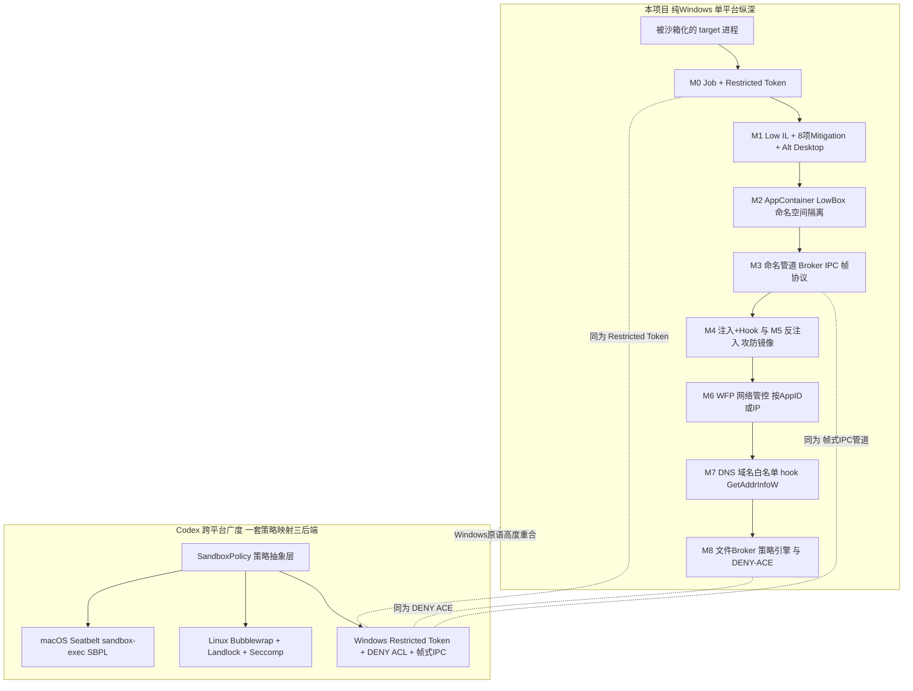

# 我们的 Sandbox vs OpenAI Codex Sandbox — 对比分析

> 对比对象：
> - **本项目**：`AI-Agent_Sandbox / sandbox_demo`，一个**纯 Windows、从内核对象机制出发**逐层搭建的 AI-Agent 沙箱学习/演示工程（M0~M8 已完成）。
> - **Codex Sandbox**：OpenAI Codex CLI 的多平台命令执行沙箱（macOS Seatbelt / Linux Bubblewrap+Landlock+Seccomp / Windows Restricted Token+ACL）。
>
> 依据：Codex 侧来自 DeepWiki `openai/codex` Sandboxing Implementation（索引于 2026-08，含 `seatbelt.rs`/`bwrap.rs`/`landlock.rs` 等源码引用）；本项目侧来自 `docs/notes/M0~M8.md` 与源码。
>
> ⭐ **一个关键发现**：Codex 在 **Windows 平台的后端恰好和我们高度重合**——都是 `Restricted Token + DENY ACE + 受限令牌启动子进程 + 帧式 IPC 管道`。所以本对比既是"两个沙箱的宏观差异"，也是"我们手写实现 vs 工业级产品在同一套 Windows 原语上的做法印证"。

---

## 一、定位差异（先厘清，别拿苹果比橘子）

| | 本项目 | Codex Sandbox |
|---|---|---|
| 本质 | **学习/作品集工程**：吃透 Windows 沙箱每一层内核机制 | **生产工具**：给 LLM agent 执行 shell 命令兜底安全 |
| 平台 | 纯 Windows（深挖单平台） | 跨平台（macOS/Linux/Windows 三后端） |
| 目标 | "理解并手写每一层围栏" | "在任意平台上把 agent 命令关进合适的笼子" |
| 广度 vs 深度 | **单平台纵深**（内核对象 → 注入/hook → 网络 → 文件，9 层） | **跨平台广度**（一套策略抽象映射到三种 OS 原语） |
| 隔离对象 | 一个被沙箱化的 target 进程 | 每次 agent 发起的命令执行（exec） |

**一句话**：我们是"把 Windows 沙箱的地基从内核对象一路夯到文件 broker"，Codex 是"用一层策略抽象屏蔽三个 OS 的沙箱原语差异"。深度 vs 广度。

### 架构对比图

> 图读法：左栈是我们在**单一 Windows 平台上的九层纵深**（每层一个 milestone）；右栈是 Codex 用**一层策略抽象**分发到三个 OS 后端。虚线标出的三条正是"我们的实现和 Codex Windows 后端撞车"的关键点——Restricted Token / DENY ACE / 帧式 IPC 管道。Codex 的 Windows 后端只对应我们 O1/O4/O8 三层，我们额外做了 O2/O3/O5/O6/O7（Mitigation、AppContainer、注入攻防、WFP、DNS hook）这些 Codex 场景不覆盖的纵深。

---

## 二、相同点

1. **同一套安全哲学：最小权限 + 纵深防御**
   - 都默认"能不给的权限就不给"，多层护栏叠加，不指望单点。

2. **Windows 后端撞车：Restricted Token + DENY ACE**
   - Codex Windows：`spawn_conpty_process_as_user` 用**受限令牌**启动命令 + `add_deny_read_ace`/`add_deny_write_ace` 操作目录 ACL。
   - 我们：M0 `CreateRestrictedToken` + M8 形态 B `FileAcl` 追加 **DENY-WRITE ACE**（`SetNamedSecurityInfo`）。
   - **几乎是同一套 API 思路**——这条最能证明我们的实现"接地气、对得上工业做法"。

3. **文件访问分级：只读 / 可写目录分离**
   - Codex：`ReadOnly` / `WorkspaceWrite` 模式，`WorkspaceWrite` 下仍强制 `.git`/`.agents`/`.codex` 只读。
   - 我们：M8 形态 A 多规则白名单——只读目录 `C:\sandbox_share` + 可写目录 `C:\sandbox_write`，命中规则后再判读写维度。

4. **敏感路径硬保护 + 审计全局可写目录**
   - Codex：`audit_everyone_writable` 扫 `TEMP`/`PATH`/`USERPROFILE` 这类可能绕过沙箱的全局可写目录。
   - 我们：M8 broker 白名单前缀 + `..` 拒绝 + **GetFinalPathNameByHandle 真身校验**防目录穿越（同一类"防绕过"思路，我们更侧重 TOCTOU）。

5. **特权宿主 ↔ 受限子进程的帧式 IPC**
   - Codex Windows：`run_windows_sandbox_capture...` 编排提权 runner，`FramedMessage`/`Message` 定义线协议，多阶段握手。
   - 我们：M3/M8 命名管道 + 定长头(magic/version/size)定长/变长帧协议 + 严格校验，broker(特权) ↔ target(受限)。
   - **结构完全同构**：都是"沙箱外特权进程替沙箱内进程代劳，走结构化 IPC"。

6. **网络分级管控**
   - Codex：Linux `Isolated`/`ProxyOnly`/`FullAccess` 三档。
   - 我们：M6 WFP（按进程/IP 拦 outbound）+ M7 DNS 域名白名单（比"全开/全关"更细到域名维度）。

7. **沙箱拒绝的可观测性**
   - Codex：`is_likely_sandbox_denied` 从 stderr 识别 "Operation not permitted"/"Read-only file system" 等。
   - 我们：每层护栏对应明确 gle/WSAErr（如 M8 DENY-ACE → gle=5、M7 → WSAHOST_NOT_FOUND、M1 → 0xC0000142），jailbreak 测试逐项打印 SUCCESS/BLOCKED。

---

## 三、不同点

### 3.1 隔离粒度与生命周期单位

| | 本项目 | Codex |
|---|---|---|
| 隔离单位 | **长驻 target 进程**（broker 起一个 target，Job 绑定，KILL_ON_JOB_CLOSE 联动生死） | **每次命令 exec**（一条 shell 命令一个短生命周期沙箱进程） |
| 生命周期 | Job 对象内核回调保证 broker 死 target 必死 | 命令执行完即回收，无长驻概念 |

### 3.2 我们有、Codex（几乎）没有的层

- **注入 + API Hook（M4）与反注入（M5）**：Codex 是"约束 agent 起的子进程"，不涉及"往目标进程注入 DLL 改 API 行为"这种攻防技术；我们 M4/M5 是攻防镜像（注入 vs 反注入 mitigation），这是 Codex 场景用不到的维度。
- **进程 Mitigation Policy（M1）**：`PROHIBIT_DYNAMIC_CODE`/`BLOCK_NON_MICROSOFT_BINARIES`/`DISABLE_CHILD_PROCESS` 等 8 项内核级缓解——Codex Windows 后端文档未提这一层（它主要靠 Restricted Token + ACL）。
- **AppContainer/LowBox 命名空间隔离（M2）**：独立对象命名空间 + Capability SID 白名单——Codex 未用 AppContainer（它用 Restricted Token 即够）。
- **Alternate Desktop / WindowStation 隔离（M1）**：UI 层隔离，Codex 不涉及（命令执行不需要）。
- **DNS 域名维度 + 进程内 Hook（M7）**：我们用注入 hook `GetAddrInfoW` 做域名白名单（挡 DoH、区分进程）；Codex 网络管控在网络命名空间/代理层，粒度是"通/不通/走代理"，不到域名 hook 这么细。
- **WFP 内核过滤平台（M6）**：我们直接用 Windows Filtering Platform 按 AppID/IP 拦 outbound；Codex Linux 用 seccomp 拦 `connect`/`bind` 系统调用 + 命名空间——**不同层的网络管控**（我们在 WFP filter engine，它在 syscall/namespace）。

### 3.3 Codex 有、我们没有的层

- **跨平台抽象层**：一套 `SandboxPolicy` 映射到三种 OS 原语——这是产品必需的工程量，我们纯 Windows 不需要。
- **macOS Seatbelt（SBPL）后端**：`sandbox-exec` + 动态生成 Sandbox Profile Language 脚本——平台专属，我们没有。
- **Linux Bubblewrap + Landlock + Seccomp**：命名空间隔离（`--unshare-user/pid/net`）+ Landlock 文件规则集 + seccomp syscall 过滤——Linux 专属三件套。
- **审批策略引擎（AskForApproval）**：Codex 有"命令执行前按策略要不要问用户"的审批层（read-only/auto/full 等模式），我们的 demo 没有交互式审批（属产品交互层，非内核安全层）。
- **命令前缀规则引擎（ExecPolicy）**：Codex 用前缀匹配决定某条命令是否允许——我们管的是"进程能碰什么资源"，不解析命令语义。

### 3.4 网络管控层级对照（同一目标不同打法）

| 需求 | 本项目 | Codex |
|---|---|---|
| 完全断网 | WFP AppID 全拦（含 loopback） | Linux `--unshare-net` / `Isolated` |
| 按 IP 白名单 | WFP IP 条件（实测本机纯用户态不命中，AppID 兜底） | 网络命名空间 + 代理 |
| 按域名白名单 | M7 hook `GetAddrInfoW`（进程内、明文域名、挡 DoH） | 代理层（`ProxyOnly`）过滤 |
| 拦截点 | WFP filter engine（内核）/ 进程内 API hook | seccomp（syscall）/ namespace / proxy |

---

## 四、关键技术对照表（速查）

| 能力维度 | 本项目实现 | Codex 实现 |
|---|---|---|
| 权限收敛 | Restricted Token（M0）+ Low IL（M1） | Restricted Token（Windows） |
| 进程缓解 | 8 项 Mitigation Policy（M1/M5） | —（Windows 未强调） |
| 命名空间隔离 | AppContainer/LowBox（M2） | Linux namespaces（`--unshare-*`） |
| 文件只读/可写分离 | M8 多规则白名单 | ReadOnly/WorkspaceWrite |
| 文件"外部剥夺" | M8 DENY-WRITE ACE | `add_deny_write_ace`（Windows） |
| 防路径绕过 | GetFinalPathNameByHandle 真身校验（防 TOCTOU） | `audit_everyone_writable` 审计 + 敏感目录只读重挂 |
| 特权/受限 IPC | 命名管道帧协议（M3/M8） | 帧式管道 `FramedMessage`（Windows） |
| 网络管控 | WFP（M6）+ DNS hook（M7） | namespace/seccomp/proxy（Linux）、Seatbelt net（mac） |
| 注入/hook 攻防 | M4 注入 + M5 反注入（独有） | —（不涉及） |
| 生死联动 | Job KILL_ON_JOB_CLOSE | 命令执行完即回收 |
| 跨平台 | ❌ 纯 Windows | ✅ mac/Linux/Windows |
| 审批/命令策略 | ❌（无交互审批层） | ✅ AskForApproval + ExecPolicy |

---

## 五、结论：互补而非竞争

- **Codex 是"横向"的**：一套策略抽象覆盖三平台，重点是"任意 OS 上安全跑一条 agent 命令"，深度到"够用即止"（Windows 就 Restricted Token + ACL + 帧式 IPC）。
- **我们是"纵向"的**：死磕 Windows 一个平台，从内核对象 → token/IL/mitigation → 命名空间 → 注入攻防 → WFP → DNS → 文件 broker，**把每一层的内核机制和坑都吃透**，还多出 Codex 场景用不到的注入/hook 攻防维度。

**面试口径**：
> "我这套沙箱和 OpenAI Codex 的 Windows 后端在核心原语上高度一致——都是 Restricted Token + DENY ACE + 受限令牌启动 + 帧式 IPC 管道，这说明我的实现路子是对的、跟工业级产品对得上。区别在于 Codex 是跨平台产品、每平台深度做到够用即止，而我在 Windows 上做了纵深：额外覆盖了 Mitigation Policy、AppContainer 命名空间隔离、WFP 网络过滤、DNS 域名 hook，以及注入/反注入这条 Codex 场景不涉及的攻防维度。一个求广、一个求深，正好互补。"

---

## 六、下次触发本文档

- "我们的沙箱和 Codex/业界产品比怎么样？" → 全文
- "Codex 在 Windows 上怎么做沙箱？" → § 二.2、§ 四（和我们撞车的那几行）
- "我们哪些能力是 Codex 没有的 / 反之？" → § 3.2 / § 3.3
- 相关：`why_sandbox_for_agent.md`（工程动机总纲）、各 `M*.md`
